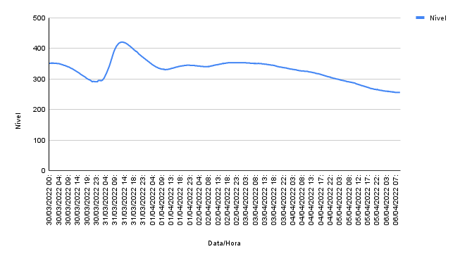
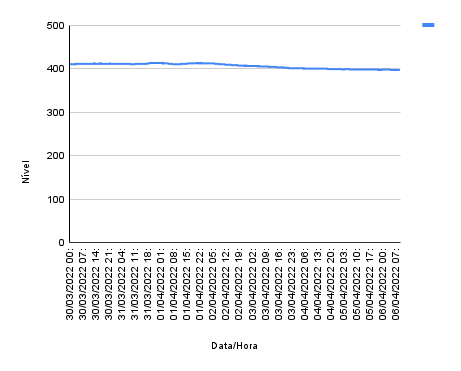
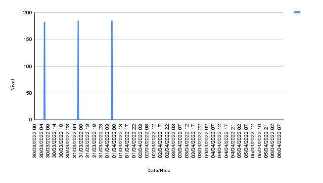
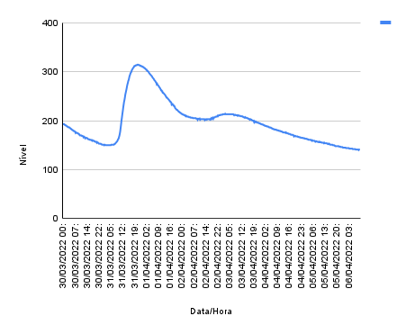
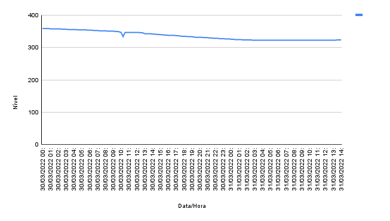

# leitura-de-dados-hidrometeorologicos

## Sumário

- [leitura-de-dados-hidrometeorologicos](#leitura-de-dados-hidrometeorologicos)
  - [Sumário](#sumário)
  - [Motivação](#motivação)
  - [Pilha de tecnologia](#pilha-de-tecnologia)
  - [Galeria](#galeria)
  - [Como rodar](#como-rodar)
    - [Pré-requisitos](#pré-requisitos)
    - [Passo a passo](#passo-a-passo)

## Motivação

Este app faz a leitura do nível, vazão e chuva dos rios Aquidauana, Taquari, Paraguai, Miranda e Pardo da última semana até o momento em que o app é rodado em intervalos de quinze minutos. Os dados são disponibilizados em XML pela API da Agência Nacional de Águas e Saneamento Básico (ANA) e convertidos em JSON pelo módulo [`xml2js`](http://npmjs.com/package/xml2js). O _endpoint_ que disponibiliza estes dados exige o código da estação, isto é, um código respectivo ao rio para puxar os dados do mesmo. Estes são os códigos da estação utilizados neste app:

| Nome do rio | Código da estação |
|-|-|
| Rio Aquidauana |  66945000 |
| Rio Taquari |  66870000 |
| Rio Paraguai |  66825000 |
| Rio Miranda |  66900000 |
| Rio Pardo |  63970000 |

Após a conversão em JSON, os dados são gravados no arquivo [`leituras.csv`](./leituras.csv), o qual totaliza quase três mil linhas. Então, através do editor de planilhas Google Spreadsheets[<sup>1</sup>](#nota-de-rodape-1), foi plotado um gráfico para cada rio, monitorando seu nível em função do tempo.

Este foi o primeiro repositório de código apresentado no [Curso Superior de TSI do IFMS](https://www.ifms.edu.br/campi/campus-aquidauana/cursos/graduacao/sistemas-para-internet/sistemas-para-internet) como requisito para obtenção da nota parcial das atividades da unidade curricular Linguagem de Programação I.

<sup id="nota-de-rodape-1">1</sup> O professor instruiu cada discente a utilizar um editor de planilhas de sua preferência.

## Pilha de tecnologia

As seguintes tecnologias foram utilizadas para desenvolver este app:

| Papel | Tecnologia |
|-|-|
| Ambiente de execução | [Node](https://nodejs.org/en/) |
| Linguagem de programação | [TypeScript](https://www.typescriptlang.org/) |
| Base de dados | [ServiceANA](https://telemetriaws1.ana.gov.br/ServiceANA.asmx) |
| Plotagem de gráficos | [Google Spreadsheets](https://www.google.com/sheets/about/) |

## Galeria

As figuras abaixo apresentam os níveis dos rios Aquidauana, Taquari, Paraguai, Miranda e Pardo, respectivamente, da meia-noite do dia 30 de março de 2022 até às 10h do dia 6 de abril de 2022.







## Como rodar

### Pré-requisitos

- [Node](https://nodejs.org/en/download/);
- [Yarn](https://yarnpkg.com/) (opcional).

### Passo a passo

1. Clone o repositório de código em sua máquina;
   
2. Abra um shell de comando de sua preferência (prompt de comando, PowerShell, terminal _etc_.);

3. Instale as dependências do projeto através do seguinte comando:

```console
$ npm install
```

Caso esteja utilizando o gerenciador de pacotes Yarn, execute o seguinte comando como alternativa:

```console
$ yarn
```

4. Finalmente, execute o seguinte comando para iniciar o app:

Para npm:

```console
$ npm run start
```

Para Yarn:

```console
$ yarn start
```